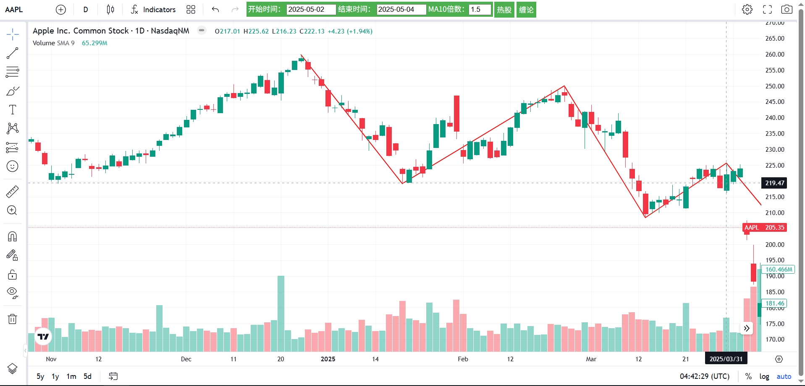

# moerChanThoeryUI
This project is a K_line Tools about Chan Thoery of MOER. 

## About Project
 Four years ago, it was my first time to learn a Stock Thoery named ChanLun. My teacher is Moer(摩尔).
 During this period, I write code by `C, Java, Python`. Now, I think my product-level Analy & Draw software has been completed.
## Important Thing!
 When we study chemistry, the chemical reaction equation is the most important, because it is difficult for the equation to become unreliable. 
 The same is true of the stock market. We need to find an equation and do NOT get lost in the changes.
 
## Next Step
 I want to find out Third Buy/Sell Point, and draw on the k-chart.