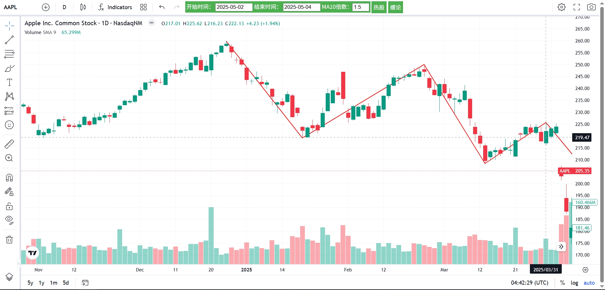
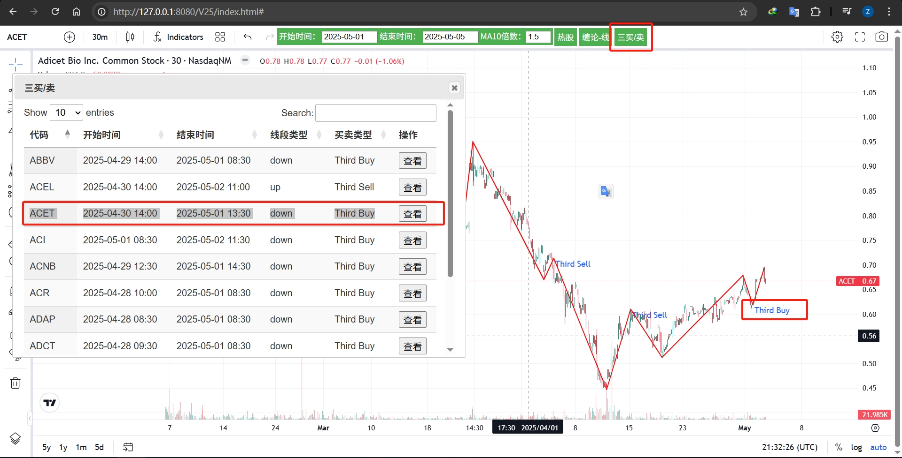

# moerChanThoeryUI
 这是一个关于使用摩尔缠论进行k线分析与划线的项目。
 

## 关于本项目
 四年前开始学习缠论，偶然间得到了`摩尔缠论`的资料，便开始学习。反反复复，断断续续，不断折腾，摸索，感悟。
 一开始编写了通达信的dll拓展，基于C语言，慢得要死；后来改用Java，也不行，编写的逻辑倒是有点精进；再后来，想：一定要脱离交易所软件的限制，把数据与软件都本地化，变成自己高度自定义的软件，就开始下载数据，编写代码，找k线显示插件。
 现在终于能跑通全部流程了。
## 流程
 - yfinance下载股票数据到本地postgres数据库，包括1w，1d，4h，30m，5m
 - 运行moer_chan脚本进行股票数据分析，得到线段结果并保存本地postgres数据库
 - 运行web server的脚本，`python http_server.py`
 - 运行api server脚本，`python app.py`
 - 浏览器访问chart_library页面`http://127.0.0.1:<port>/V25/index.html`
### 环境说明
 - 数据库：`PostgreSQL 16.4, compiled by Visual C++ build 1941, 64-bit`
 - python: V3.9.19
 - Web Page: HTML + Jquery 3.6.0
## 重要的事!
 [找到不变的事，才是基石。](https://www.cnblogs.com/dzmsjs/articles/18786042)
 